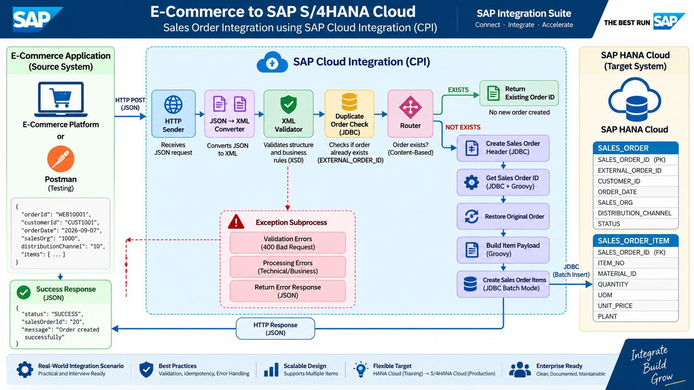

## Architecture




# E-Commerce → SAP CPI → HANA Cloud Sales Order Integration

An end-to-end SAP Cloud Integration (CPI) project that receives sales orders from an e-commerce application, validates the request, checks for duplicate orders, creates the Sales Order header and items in SAP HANA Cloud, and returns the generated Sales Order ID.

> **Project Status: Completed and End-to-End Tested ✅**

---

## 📌 Project Overview

This project demonstrates a real-world enterprise integration scenario using SAP Integration Suite / Cloud Integration.

The solution simulates an e-commerce application sending an order to SAP CPI through REST/JSON.

SAP CPI performs validation and business processing, then persists the Sales Order header and item data into SAP HANA Cloud using the JDBC Receiver Adapter.

Postman is used to simulate the e-commerce source system.

### Business Flow

```text
E-Commerce / Postman
        |
        | REST / JSON
        v
+----------------------+
| SAP Cloud Integration|
|       (CPI)          |
+----------+-----------+
           |
           | JDBC
           v
+----------------------+
|   SAP HANA Cloud     |
| Sales Order Tables   |
+----------------------+
🎯 Business Requirement

Whenever a customer places an order in an e-commerce application:

CPI receives the order through an HTTP endpoint.
CPI validates the incoming request.
CPI checks whether the order already exists.
If the order already exists, CPI returns the existing Sales Order ID.
If the order is new, CPI creates the Sales Order header.
CPI retrieves the generated Sales Order ID.
CPI creates all order items under the same Sales Order.
CPI returns a clean JSON response to the e-commerce application.
🏗️ Integration Architecture
                    E-Commerce System
                         / Postman
                             |
                             |
                         HTTP / JSON
                             |
                             v
                +-------------------------+
                |       HTTP Sender      |
                |          SAP CPI        |
                +-----------+-------------+
                            |
                            v
                +-------------------------+
                |   JSON → XML Converter  |
                +-----------+-------------+
                            |
                            v
                +-------------------------+
                |     XML Validation      |
                |        XSD Schema        |
                +-----------+-------------+
                            |
                            v
                +-------------------------+
                | Exchange Properties &   |
                | Business Processing     |
                +-----------+-------------+
                            |
                            v
                +-------------------------+
                |   Duplicate Check       |
                |      HANA SELECT        |
                +-----------+-------------+
                            |
                    +-------+-------+
                    |               |
                 EXISTS         NOT EXISTS
                    |               |
                    v               v
             Return Existing   Create Header
             Sales Order ID         |
                                    v
                           Get Sales Order ID
                                    |
                                    v
                            Groovy Script
                                    |
                                    v
                           Restore Original
                              Order XML
                                    |
                                    v
                            Groovy Script
                           Build Item SQL
                                    |
                                    v
                           JDBC Batch Mode
                                    |
                                    v
                            SAP HANA Cloud
                                    |
                                    v
                           Final JSON Response
🔄 CPI Integration Flow

The main integration flow is:

HTTP Sender
    ↓
JSON to XML Converter
    ↓
XML Validator
    ↓
Content Modifiers
    ↓
HANA Duplicate Check
    ↓
Router
    │
    ├── EXISTS
    │      ↓
    │   Return Existing Sales Order ID
    │
    └── NOT EXISTS
           ↓
       Insert Sales Order Header
           ↓
       Select Generated Sales Order ID
           ↓
       Groovy - Extract Sales Order ID
           ↓
       Restore Original Order
           ↓
       Groovy - Build Item Insert Payload
           ↓
       JDBC Batch Mode
           ↓
       Final JSON Response
📥 Sample Input

The e-commerce system sends an order in JSON format.

{
  "orderId": "WEBMULTI001",
  "customerId": "CUST1001",
  "orderDate": "2026-09-07",
  "salesOrg": "1000",
  "distributionChannel": "10",
  "items": [
    {
      "itemNo": 10,
      "materialId": "MAT101",
      "quantity": 2,
      "unitPrice": 1500
    },
    {
      "itemNo": 20,
      "materialId": "MAT102",
      "quantity": 5,
      "unitPrice": 2500
    }
  ]
}
✅ Validation

The integration validates the incoming request before calling the target database.

Mandatory fields
orderId
customerId
salesOrg
distributionChannel
items
Item validation
At least one item is required.
Quantity must be greater than zero.

Invalid requests are rejected before the target system is called.

Example Error Response
{
  "status": "ERROR",
  "message": "Invalid order request"
}

The integration uses an Exception Subprocess to handle validation failures and return an HTTP 400 Bad Request.

🔁 Idempotency

Idempotency is implemented to prevent duplicate Sales Orders.

The e-commerce order ID is stored as:

EXTERNAL_ORDER_ID

Before creating a new Sales Order, CPI checks HANA using the incoming:

orderId
New Order
orderId = WEB10001
        ↓
HANA Duplicate Check
        ↓
Order does not exist
        ↓
Create Sales Order
Duplicate Order
orderId = WEB10001
        ↓
HANA Duplicate Check
        ↓
Order already exists
        ↓
Return existing Sales Order ID
Duplicate Response
{
  "status": "SUCCESS",
  "salesOrderId": "20",
  "message": "Order already exists"
}

No second Sales Order header is created.

📦 Multiple Item Processing

A single e-commerce order can contain multiple items.

For example:

Sales Order ID = 19

Item 20 → MAT101 → Quantity 2 → Unit Price 1500
Item 30 → MAT102 → Quantity 5 → Unit Price 2500

Both items belong to the same Sales Order.

The Groovy script dynamically generates the JDBC XML payload.

Example generated payload:

<root>
    <Insert_Statement1>
        <dbTableName action="INSERT">
            <table>SALES_ORDER_ITEM</table>

            <access>
                <SALES_ORDER_ID>19</SALES_ORDER_ID>
                <ITEM_NO>20</ITEM_NO>
                <MATERIAL_ID>MAT101</MATERIAL_ID>
                <QUANTITY>2</QUANTITY>
                <UOM>EA</UOM>
                <UNIT_PRICE>1500</UNIT_PRICE>
                <PLANT>1000</PLANT>
            </access>

            <access>
                <SALES_ORDER_ID>19</SALES_ORDER_ID>
                <ITEM_NO>30</ITEM_NO>
                <MATERIAL_ID>MAT102</MATERIAL_ID>
                <QUANTITY>5</QUANTITY>
                <UOM>EA</UOM>
                <UNIT_PRICE>2500</UNIT_PRICE>
                <PLANT>1000</PLANT>
            </access>

        </dbTableName>
    </Insert_Statement1>
</root>

JDBC Batch Mode processes both records.

Example response:

<root>
    <Insert_Statement1>
        <table>SALES_ORDER_ITEM</table>
        <insert_count>2</insert_count>
    </Insert_Statement1>
</root>
💻 Groovy Scripting

Groovy is used to extract the generated Sales Order ID from the JDBC response.

import com.sap.gateway.ip.core.customdev.util.Message
import groovy.util.XmlParser

def Message processData(Message message) {

    def body = message.getBody(String)

    def xml = new XmlParser().parseText(body)

    def salesOrderId = xml.select_response.row.SALES_ORDER_ID.text()

    message.setProperty("salesOrderId", salesOrderId)

    return message
}

The extracted Sales Order ID is then reused while creating the Sales Order items.

🗄️ HANA Cloud Data Model
SALES_ORDER
Column	Description
SALES_ORDER_ID	Internal Sales Order ID
EXTERNAL_ORDER_ID	E-commerce order ID
CUSTOMER_ID	Customer
ORDER_DATE	Order date
SALES_ORG	Sales organization
DISTRIBUTION_CHANNEL	Distribution channel
STATUS	Sales Order status
SALES_ORDER_ITEM
Column	Description
SALES_ORDER_ID	Related Sales Order
ITEM_NO	Item number
MATERIAL_ID	Material
MATERIAL_DESCRIPTION	Material description
QUANTITY	Ordered quantity
UOM	Unit of measure
UNIT_PRICE	Unit price
NET_VALUE	Net value
PLANT	Plant
🧪 Testing

The integration was tested using Postman and SAP HANA Cloud SQL Console.

Test Case 1 — Valid Order

Expected:

Sales Order header and items are created successfully.

Result: ✅ PASS

Test Case 2 — Invalid Customer

An invalid/blank customer request was submitted.

Expected:

HTTP 400 Bad Request

The target system should not be called.

Result: ✅ PASS

Test Case 3 — Quantity = 0

An order containing:

"quantity": 0

was submitted.

Expected:

Request rejected.

Result: ✅ PASS

Test Case 4 — Negative Quantity

An order containing a negative quantity was submitted.

Expected:

Request rejected.

Result: ✅ PASS

Test Case 5 — Multiple Items

One order containing two items was submitted.

Expected:

One Sales Order header and two Sales Order item records.

Result: ✅ PASS

Example:

Sales Order ID = 19

Item 20 → MAT101 → Qty 2
Item 30 → MAT102 → Qty 5

Both items were successfully stored against the same Sales Order ID.

Test Case 6 — Duplicate Order / Idempotency

The same order was submitted twice.

Expected:

No duplicate Sales Order should be created.

Actual Response:

{
  "status": "SUCCESS",
  "salesOrderId": "20",
  "message": "Order already exists"
}

Result: ✅ PASS

Database verification confirmed that only one Sales Order header exists for the external order ID.

🛠️ SAP CPI Components Used

This project demonstrates practical usage of:

HTTP Sender Adapter
JSON to XML Converter
XML Validator
XSD
Content Modifier
Exchange Properties
Router
Request Reply
JDBC Receiver Adapter
JDBC Batch Mode
Groovy Script
Exception Subprocess
HANA Cloud
Postman
🧠 Key Integration Concepts Demonstrated
1. Message Transformation

JSON input from the e-commerce system is converted into XML for downstream CPI processing.

2. Schema Validation

XSD validation ensures that the incoming message follows the required structure and business rules.

3. Routing

A Router determines whether the order already exists.

EXISTS → Return Existing Order
NOT EXISTS → Create New Order
4. Request Reply

Request Reply is used to communicate synchronously with the HANA database through the JDBC Receiver Adapter.

5. Exchange Properties

Important values such as:

orderId
customerId
salesOrg
distributionChannel
salesOrderId
originalOrder

are maintained as exchange properties during processing.

6. Groovy

Groovy is used where custom message processing is required, particularly for:

Extracting the generated Sales Order ID.
Building dynamic multi-item JDBC payloads.
7. Idempotency

The external e-commerce order ID is used to prevent duplicate order creation.

8. Exception Handling

Invalid requests and processing exceptions are handled through the CPI Exception Subprocess.

📁 Repository Structure
sap-cpi-ecommerce-sales-order/
│
├── README.md
│
├── database/
│   ├── create-sales-order.sql
│   └── create-sales-order-item.sql
│
├── documentation/
│   ├── architecture.md
│   ├── architecture.png
│   └── test-cases.md
│
└── ecom to s4hana/
    └── SAP Integration Suite exported package

The database directory contains the HANA Cloud table creation scripts.

The documentation directory contains the integration architecture,
architecture diagram, and test cases.

The ecom to s4hana directory contains the exported SAP Integration
Suite package.

🚀 Future Enhancement

The current project uses SAP HANA Cloud as the target backend for training and demonstration purposes.

The same integration pattern can later be extended to a real SAP S/4HANA Cloud backend.

Future Architecture
E-Commerce / Salesforce
          |
          | REST / JSON
          v
     SAP CPI
          |
          | OData
          v
   SAP S/4HANA Cloud
          |
          v
    Sales Order

The JDBC receiver can be replaced with the appropriate S/4HANA Sales Order API while retaining the core integration concepts such as:

Validation
Routing
Error handling
Idempotency
Multi-item processing
Response handling
🔐 Security Considerations

No passwords, database credentials, API secrets, access tokens, or other sensitive credentials are stored in this repository.

CPI credentials and connection details should be maintained using appropriate SAP Integration Suite security mechanisms rather than hard-coded in integration artifacts or source control.

📊 Project Outcome

This project demonstrates an end-to-end enterprise integration scenario:

E-Commerce
     ↓
REST / JSON
     ↓
SAP Cloud Integration
     ↓
Validation
     ↓
Duplicate Check
     ↓
Business Routing
     ↓
Sales Order Creation
     ↓
Multiple Item Processing
     ↓
JDBC Batch Processing
     ↓
SAP HANA Cloud
     ↓
JSON Response

The solution successfully handles both business success scenarios and error/duplicate scenarios.

👨‍💻 Author

Mahesh Goud

SAP Integration / CPI Learning Project

⭐ Skills Demonstrated

SAP Integration Suite | SAP CPI | Groovy | JDBC | SAP HANA Cloud | REST | JSON | XML | XSD | Postman | Integration Patterns | Idempotency | Error Handling | Message Transformation


Add complete SAP CPI project documentation
